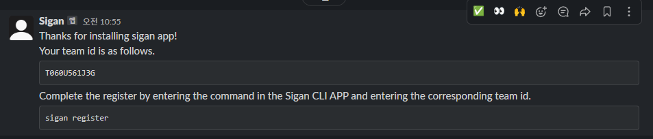
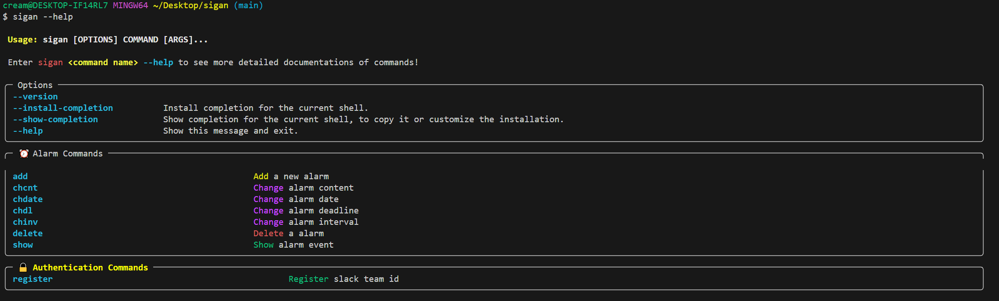
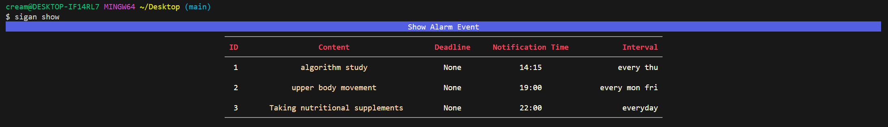

<h1 align="center">🙏 Sigan - Very simple CLI slack alarm manager 🙏</h1>

<h4 align="center">간단한 CLI를 통해 알람을 설정할 수 있는 편리한 앱입니다. 간단한 명령으로 Slack에 알람을 만들어 보세요!.</h4>

# 🛎 Current Version `0.1.20`

#### Upgrade with `pip install sigan --upgrade`

# 🚀 Installation & Settings


먼저 아래 버튼 링크를 통해 slack app을 다운로드 받아야 합니다.
(링크 우측 상단에 설치하실 워크스페이스를 선택하실 수 있습니다.)

<h5 align="center"><a href="https://slack.com/oauth/v2/authorize?client_id=5494283259505.5897839296482&scope=channels:history,channels:read,chat:write,groups:read,im:history,im:read,mpim:read&user_scope="></a></h5>

아직 slack 측의 정식 승인 되지않았지만 추후 정식 승인을 받을 것입니다. 해킹 프로그램이 있는 것은 아니니 오해 안하셔도 됩니다! ><

링크를 통해 `Sigan Slack APP`을 다운 받으셨다면 아래와 같이 메시지가 도착합니다. 메시지에서 team id가 도착했는지 확인해주시고 복사해주세요!
![[register message.png]]

먼저 python이 `3.9` 버전 이상인지 확인해주세요. 이후 아래의 커맨드를 터미널에 입력합니다.

```bash
pip install sigan
```

설치가 끝났다면 아래의 커맨드로 등록을 진행합니다.

```bash
sigan register
```

그러면 team id를 입력하라는 문구가 나오고 이전에 복사해두었던 team id를 입력합니다.


올바른 team id를 입력했다면 등록이 완료되었다는 메시지가 DM으로 도착합니다.

이제 모든 준비는 마쳤습니다! 하지만 제한 사항이 몇가지만 확인해주세요!

# ⚠️ Restrictions

- 이 프로젝트는 미숙한 어린이가 만든 프로젝트로 이상한 코드와 좋지 않은 구현들이 많습니다. 곧 새롭고 더 나은 프로젝트가 될 수 있도록 노력하겠습니다.

- 최대 120일 후의 메시지 예약을 설정할 수 있습니다.
- 동일한 채널에 5분 이내에 게시할 30개 이상의 메시지를 예약할 수 없습니다.
	-  [Slack API reference](https://api.slack.com/methods/chat.scheduleMessage#restrictions)

- 설정된 알람이 5분 이내에 전송될 경우 삭제가 불가능하다는 에러를 발생시킵니다.
- 이는 공식문서에서는 1분 이내라고 안내되어 있지만 버그로 인한 것인지 API에선 "OK"를 반환하지만 백그라운드에서 실패합니다.
	- [Slack API reference](https://api.slack.com/methods/chat.deleteScheduledMessage#restrictions)
	- [Reference](https://stackoverflow.com/questions/67575370/deleted-scheduled-messages-still-sending)

- Sigan bot은 하나의 slack workspace에서만 동작합니다.
	- 만약 다른 slack workspace에서 이용하시려면 상단의 `App to Slack` 버튼 링크를 통해 새로운 slack workspace에 설치하고 다시 `sigan register`를 진행해야합니다.
	- 또한 기존 slack workspace에 있던 sigan bot을 제거해야합니다.

# 👨‍💻 Commands

## 0. Information

전반적인 command의 정보를 알고 싶다면 아래의 커맨드로 확인할 수 있습니다.

```bash
sigan --help
```



더욱 구체적인 command의 정보를 알고 싶다면 아래의 커맨드로 확인할 수 있습니다.

```bash
sigan <command name> --help 
```

sigan CLI의 버전은 아래의 커맨드로 확인할 수 있습니다.

```bash
sigan --version
```
## 1. add command

```bash
sigan add <content> [-d | --deadline <deadline date>] [-t | --time <notification date> [-i | --interval <day of the week>] [-b | --before <Set confirm alarm date x days before deadline>]] [-c | --channel <Select slack channel>]
```

### 1.1 add command rule < content >

- `<content>` **필수사항**입니다. 
- 만약 content에 공백이 있다면 `""` 을 사용해서 입력해주세요. 공백이 없다면 `""`을 생략할 수 있습니다.

### 1.2 add command rule < deadline >

-  `-d | --deadline <deadline date>` **선택사항**입니다. 
- Deadline을 설정한 경우 notification time과 별개로 deadline 하루 전에 확인(confirm) 알람을 보냅니다.
	- 만약 deadline 하루 전말고 다른 날로 설정하고 싶다면 `-b | --before` 커맨드로 deadline보다 며칠 전에 확인 알람을 보낼지 설정할 수 있습니다.
	- Deadline을 설정하지 않는다면 확인 알람을 보내지 않습니다.

### 1.3 add command rule < notification time > 

- `-t | --time <notification date>` 어느정도 **선택사항**입니다.
- 시간을 설정하지 않고 날짜만 입력했을 경우 default 값인 09:00 로 설정됩니다.
- 시간만 입력한 경우 `-i | --interval` 커맨드로 반복 주기를 설정해야합니다.
	- ex) `sigan add "notification setting" -t 12:10 -i thu`

### 1.4 add command rule < interval >

-  `-i | --interval <day of the week>` 어느정도 **선택사항**입니다.
- 2개 이상의 요일에 반복해서 알람을 보내고 싶다면 `""`를 이용해 여러 요일을 선택할 수 있습니다.
	- ex) `sigan add "interval setting" -t 15:00 -i "mon fri"`
- 알람의 날짜와 시간 모두 입력했을 경우 interval 커맨드는 사용할 수 없습니다.

### 1.5 add command rule < before >

-  `-b | --before <Set confirm alarm date x days before deadline>` **선택사항**입니다.
	- ex) `sigan add "before test" -d 10/20 -t 14:00 -i mon -b 3`

### 1.6 add command rule < channel >

-  `-c | --channel <Select slack channel>` **선택사항**입니다. 
- 채널을 선택하기 위해선 먼저 해당 채널에 Sigan bot을 초대해야합니다.
	- Sigan bot이 초대된 채널의 이름을 입력하고 알람을 설정한면 해당 채널에 알람을 전송합니다.
- 채널을 선택하지 않으면 Sigan bot의 DM으로 알람을 전송합니다.

## 2. show command

`show` command로 알람 이벤트를 확인할 수 있습니다.

```bash
sigan show
```



## 3. delete command

`delete` command로 기존 알람을 삭제할 수 있습니다.

```bash
sigan delete <alarm_id> [-y | --yes]
```

`-y | --yes` 로 알람을 삭제할 때 확인 문구를 표시하지 않을 수 있습니다. 만약 설정하지 않는다면 알람을 삭제할 때 확인 문구가 출력됩니다.
## 4. chcnt command

`chcnt` command로 기존 알람의 content를 변경할 수 있습니다.

```bash
sigan chcnt <alarm_id> <content>
```

ex) `sigan chcnt 1 "test content change"`
## 5. chdl command

`chdl` command로 기존 알람의 deadline을 변경할 수 있습니다. 

```bash
sigan chdl <alarm_id> <deadline>
```

ex) `sigan chdl 1 12/25`, `sigan chdl 1 "2023/12/25"`

기존 알람의 notification time보다 더 빠른 deadline은 설정할 수 없습니다.
## 6. chdate command

`chdate` command로 기존 알람의 notification time을 변경할 수 있습니다.

```bash
sigan chdate <alarm_id> <date>
```

- 시간만 변경하는 경우
	- ex) `sigan chdate 1 -d 15:00`
- 날짜만 변경하는 경우
	- ex) `sigan chdate 1 10/24`, `sigan chdate 1 "2023/10/24"`
- 날짜와 시간 모두 변경하는 경우
	- ex) `sigan chdate 1 "2023/12/10 15:00"`

## 7. chinv command

`chinv` command로 기존 알람의 interval을 변경할 수 있습니다.

```bash
sigan chinv <alarm_id> <interval>
```

ex) `sigan chinv 1 wed`

# ⏭ What's next?

1. Interworking with Google Calendar
2. Add slack slash command


# 🚮 Uninstalling

진짜 설마 혹시나 천재지변의 이유로 삭제하려고 하신다면 아래의 command로 삭제할 수 있습니다..... 

```bash
pip uninstall sigan
```